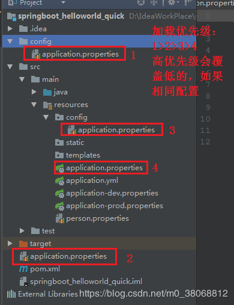

# springboot-config

> 本 demo 演示如何获取配置文件的自定义配置，以及如何多环境下的配置文件信息的获取
## 1、配置文件加载优先级

## 2、外部配置加载顺序
> 参考https://juejin.im/post/5c8f4dd06fb9a070bc3f04be

SpringBoot也可以从以下位置加载属性配置； 优先级从高到低；高优先级的配置覆盖低优先级的配置，所有的配置会形成互补配置

(1) 启动命令中传入的命令行参数

所有的配置都可以在命令行上进行指定java -jar xxx.jar --server.port=8087 --server.context-path=/abc
多个配置用空格分开； --配置项=值

(2) 加载SPRING_APPLICATION_JSON中的属性。SPRING_APPLICATION_JSON是以JSON格式配置在系统环境变量中的内容;　　

(3) 加载java:comp/dev中的JNDI属性;　　

(4) 加载Java的系统属性，可以通过System.getProperties()获取到的内容;　　

(5) 加载操作系统的环境变量;　　

(6) 加载random.*配置的随机属性;　　

(7) 加载位于当前应用jar包之外，针对不同{profile}环境的配置文件内容，比如application-{profile}.properties或者YAML定义的配置文件;　　

(8) 加载位于当前应用jar包之内，针对不同{profile}环境的配置文件内容，比如application-{profile}.properties或者YAML定义的配置文件;　　

(9) 加载位于当前应用jar包之外的application.properties和YAML配置内容;　　

(10) 加载位于当前应用jar包之内的application.properties和YAML配置内容;　　

(11) 加载含有@Configuration注解的类，通过@PropertySource注解定义的属性;　　

(12) 最后加载应用的默认属性，使用SpringApplication.setDefaultProperties定义的内容。　　

加载的优先级按照以上顺序由高到底，数字越小的优先级越高，越先被加载。在这里额外说一下(6)中提到的随机数：
在SpringBoot的属性配置文件中，可以通过使用${random}配置来产生随机的int值、long值或者string字符串，这样我们就可以容易地通过配置随机生成属性。　　
${random}的配置主要有以下几种形式：　

(1)随机字符串：　　random.stringValue=${random.value}　　

(2)随机int：　　random.intValue=${random.int}　　

(3)随机long：　　random.longValue=${random.long}　　

(4)100以内的随机数：　　random.number=${random.int(100)}　　

(5)100到1000的随机数：　　random.number=${random.int[100,1000]}

## 3、激活指定profile
1、application.properties配置文件: 

spring.profiles.active=dev

2、使用命令行：

java -jar xxxx.jar --spring.profiles.active=dev

2、虚拟机参数：

-Dspring.profiles.active=dev

**附：还可以通过spring.config.location来改变默认的配置文件位置，示例：**

java -jar xxxx.jar --spring.config.location=G:/application.properties
## 参考链接
> 最全面的SpringBoot配置文件详解

https://zhuanlan.zhihu.com/p/57693064
> 10分钟搞定 SpringBoot 如何优雅读取配置文件

https://mp.weixin.qq.com/s?__biz=Mzg2OTA0Njk0OA==&mid=2247486181&idx=2&sn=10db0ae64ef501f96a5b0dbc4bd78786&chksm=cea2452ef9d5cc384678e456427328600971180a77e40c13936b19369672ca3e342c26e92b50&token=816772476&lang=zh_CN&scene=21#wechat_redirect

> Maven简介（三）——profile介绍

https://www.iteye.com/blog/elim-1900568

> 多profile配置相关

https://blog.csdn.net/fengchao2016/article/details/72726101